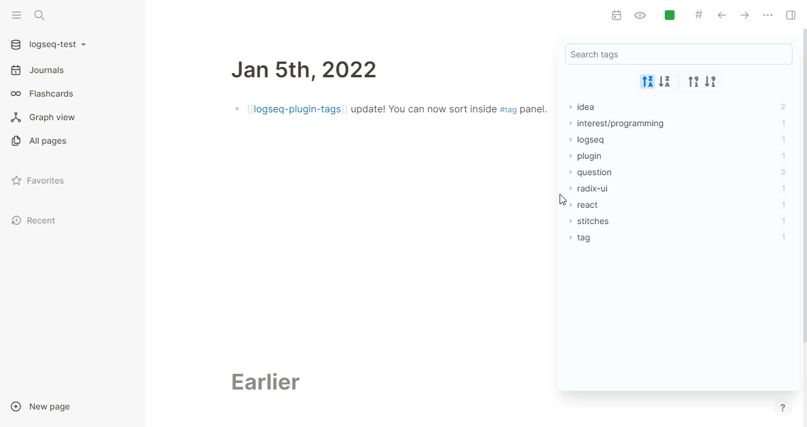

# Logseq Tags Plugin

A plugin that lets you find and search all of your `#tags`.

This plugin will query and list all `#tags`, `#[[tags]]` and page-tags(`tags:: tag, #tag, #[[tag]]`).

No wiki-links(`[[tag]]`)!

## Why?
Logseq has no distinction between `#tag` and `[[page]]`. But I use them in different context. I use `#tag` in blocks and pages as metadata which containing category and further note-developing opportunity, unlike normal links in pages.

So, I have made one. If you are looking for Obsidian-like tag pane, this is the one for you!

## How to use?
### Option 1: Install from Marketplace
1. Go to `⋯` > `Settings` > `Advanced` and enable Developer Mode.
2. Go to `⋯` > `Plugin` > `Marketplace` and install Tags plugin.

### Option 2: Manual install
Load prebuilt package from [Releases](https://github.com/gidongkwon/logseq-plugin-tags/releases) page.

## Demo
